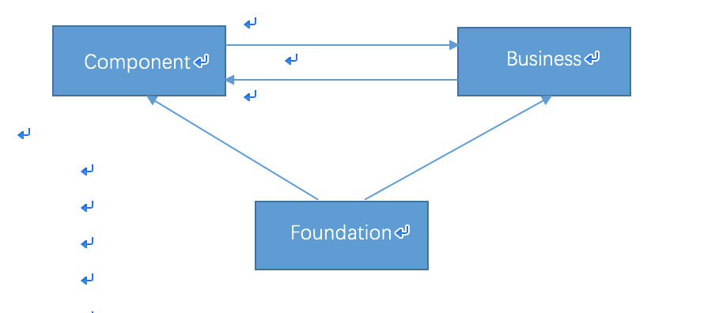
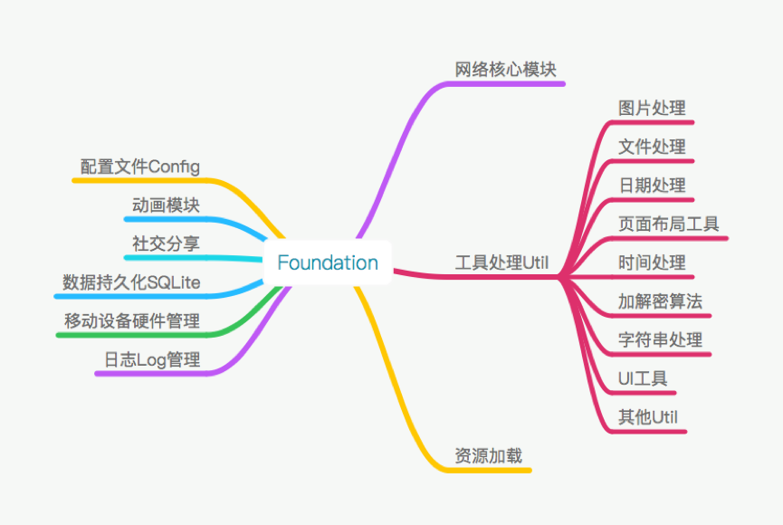
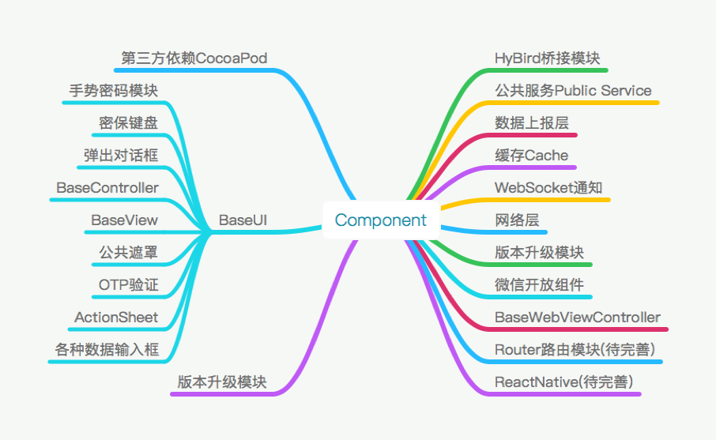
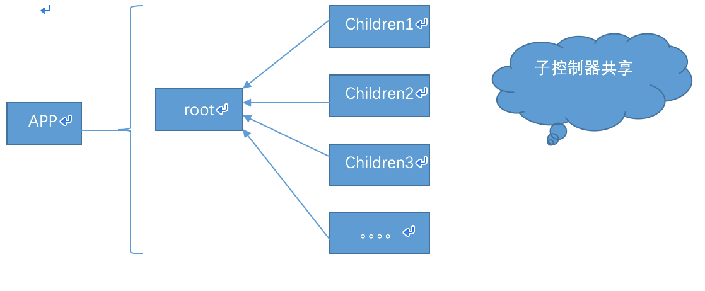

# 1、简介

APP基础架构在模块层级上分为三层分别是基础核心层(Foundation)、组件层（Component）、业务逻辑层（Business）。

其中基础核心层（Foundation）是APP的基本服务，采用模块功能性的划分跟上层的逻辑完全解耦和，除了增加新的逻辑以外，平时基本没有代码修改，基础核心层是一个完全独立于实际APP的基础代码在实际使用中可以采用Cocoapod引用或者抽象成Lib静态库的形式。

组件层（Component）这里组件是APP中具有固定功能的代码的模块的统称，可是一个完整的UI模块，也可是一个完整的支持具体业务需求的服务模块，也可以是第三方库等等，组件层起到承上启下的作用向上跟业务逻辑层进行数据交互，向下跟基础核心层请求必要的支持。

业务逻辑层（Business）是APP的功能需求，采用经典的MVC的框架组织代码。

# 2、基础核心层

Foundation

|——— 网络核心模块

|——— 数据持久化层 SQLite

|——— 资源加载

|——— 社交分享

|——— 工具处理Util（图片处理、文件目录处理、日期处理、加解密算法、时间处理、字符串处理、页面布局工具、UI工具、其他）

|——— 移动设备硬件管理

|——— 日志Log模块

|——— 动画模块

|——— 配置文件Config

# 3、组件层

Component

|——— 缓存Cache

|——— 网络层

|——— WebSocket通知

|——— BaseUI(手势密码组件、密保键盘、弹出对话框、BaseController、BaseView、公告遮罩、OTP验证、ActionSheet、各种数据输入框)

|——— 数据上报层

|——— 升级模块

|——— 第三方依赖CocoaPod

|——— 公共服务PublicService

|——— 微信开放平台组件

|———Web公共浏览器（BaseWebViewController）

|——— HyBird桥接模块

|——— JSPatch热更新模块（iOS已经废弃）

|——— `ReatNative支持（继续研究中`）

|——— `路由跳转系统 （继续完善中）`

# 4、业务逻辑层

业务逻辑层是APP具体功能的实现，采用MVC的方式组合代码，具体的一个功能可以由一个或者多个Controller来实现。基本结构实现采用组合controller的形式，APP启动是初始化一个全局的**NavigationController**作为全局的导航器，控制整个页面的跳转栈。**NavigationController**包装一个**RootViewController**作为基本的住控制器，每新增加一个业务功能模块，此业务功能模块的入口controller就作为**RootViewController**的childrenController耦合在**RootViewController**中，这样所有的子控制器可以共享一个navigation导航控制器从而可以方便的实现页面的跳转和返回。

**RootViewController**作为根控制器复杂在整个程序中的事件分发，消息处理，页面切换，路由跳转等重要的功能。

